# Droichead

**Bridge the gap to the job that's coming.** *Droichead* (DRUH-hed) is Irish for "bridge".

Droichead is a calm, private career navigator for people whose work is being reshaped by AI. It runs on open-weight Gemma 4 and works in seven languages. It was built in Dublin in one day for **Hack for Humanity** (Hacktoberfest Hack Day Dublin x The AI Collective), on the job-displacement track: *help people navigate changing roles, skills, opportunities and economic security.*

**Live demo:** https://droichead.onrender.com &nbsp;·&nbsp; **Licence:** MIT

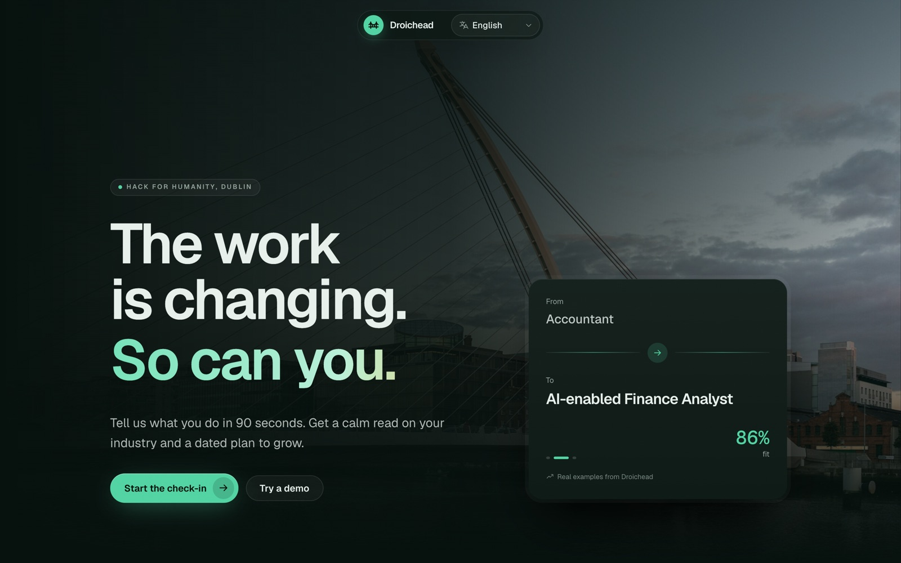

> A wish to switch jobs is a fantasy. Give it a deadline and it becomes a goal. Put a plan behind the goal and you have a strategy. Act on the strategy consistently and that is success.

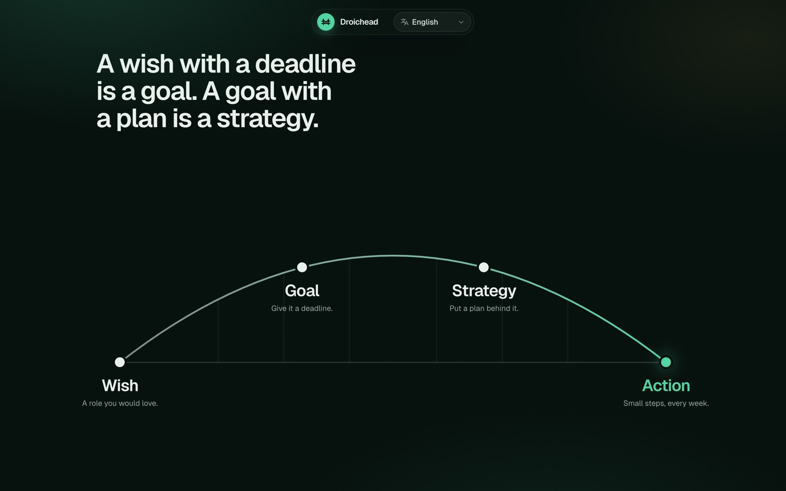

---

## The problem, locally

AI anxiety is real, and it is not evenly spread. In Ireland, a big share of the workforce works in a second language. That includes large Polish and Ukrainian communities, and international workers in Dublin's tech and finance sectors. The advice they get is generic, English-only and often fear-based. Ireland also funds excellent upskilling through Springboard+, Skillnet Ireland and SOLAS eCollege, but most people never connect those programmes to a concrete next role.

## What it does

### 1. A 90-second check-in
A playful, tap-first survey covers your role, industry, experience, optional work history, the skills you enjoy, how you feel about AI, hours per week and location. Every question can be skipped. You can **dictate** your answers, or **drop in a PDF CV**, which is read in the browser with pdf.js and never uploaded.

### 2. Pulse: what is happening, for you
- **Roles to grow into:** emerging and changing roles, such as Forward Deployed Engineer, AI Solutions Engineer and AI-enabled Finance Analyst, ranked by honest fit.
- **Industry pulse:** real articles from the last 7 days (RTÉ, Silicon Republic, the Irish Times, the Guardian, TechCrunch), each with one line on what it means for you.
- **Economic weather:** live **CSO Ireland** unemployment figures (seasonally adjusted, with under-25s shown too) beside a calm read on hiring in your sector.

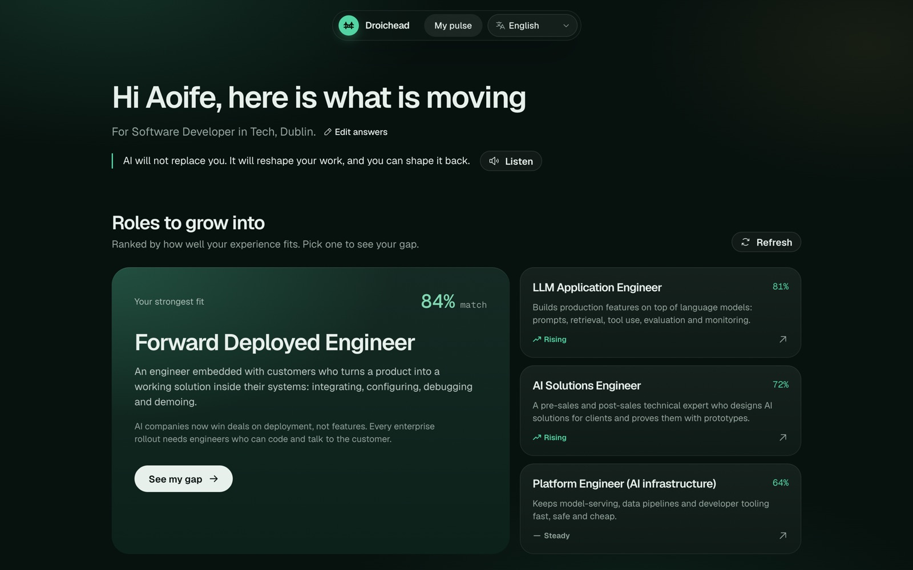
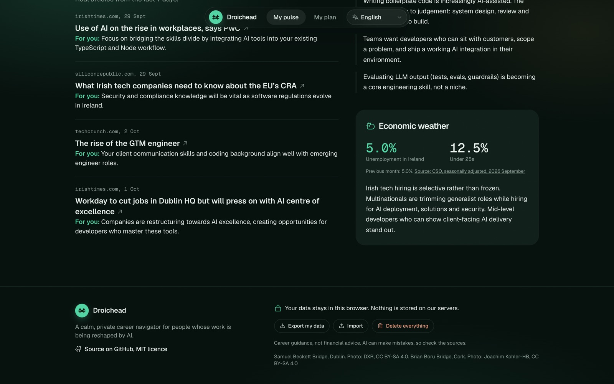

### 3. Gap analysis, honestly
It always leads with **what you already have**, then **partly there**, then **to build**, with a realistic time estimate at your hours per week. There's a **Listen** button that reads it aloud.

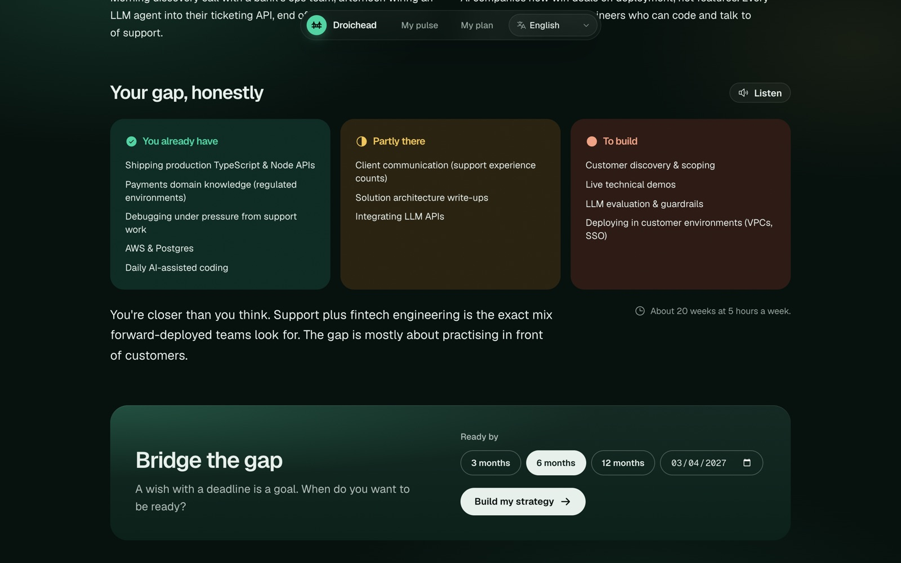

### 4. Bridge the gap
Pick a goal date and Droichead generates a phased, week-by-week strategy sized to your hours, with a portfolio project. Tasks link only to real courses and certifications from a human-checked catalogue that prefers free and government-funded Irish programmes.

### 5. My plan
- **Timeline** with checkboxes, progress, confetti when you finish a phase, and a weekly streak.
- **Add to calendar:** a `.ics` export for Google, Outlook or Apple Calendar.
- **Printable wall planner:** an A4 goal poster, month-by-month calendars with every task day marked, a week-by-week checklist, and **QR codes** that open each course from the printed page.
- **Jobs, 48h:** **live openings** from Arbeitnow and Remotive with how long ago each was posted, plus pre-filtered LinkedIn and Indeed searches for the last 48 hours.
- **LinkedIn post drafts** tied to your milestones (copy or open LinkedIn; we never post for you).
- **Events:** meetups and workshops near you.
- **Weekly check-in:** tell it you're on track, a bit behind or way behind, plus your hours next week. The plan reschedules to fit, and Gemma adds a guilt-free note and one tiny next step.

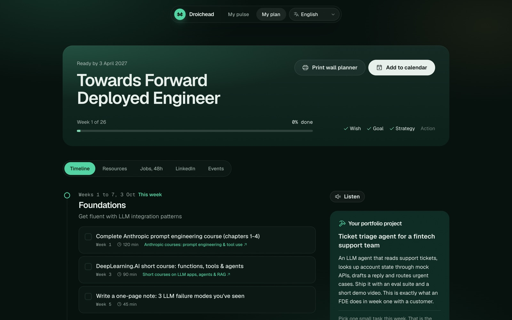
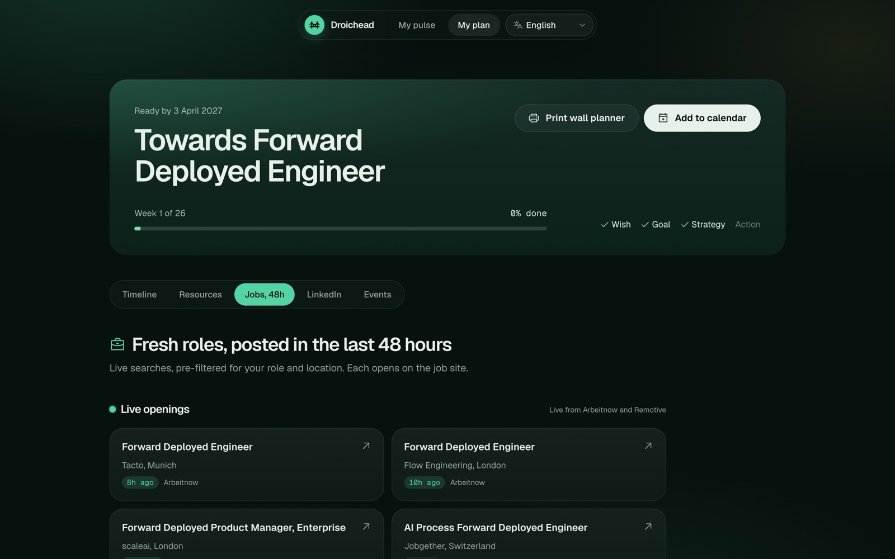

| Wall planner poster | Scan-to-open course sheet |
|---|---|
| 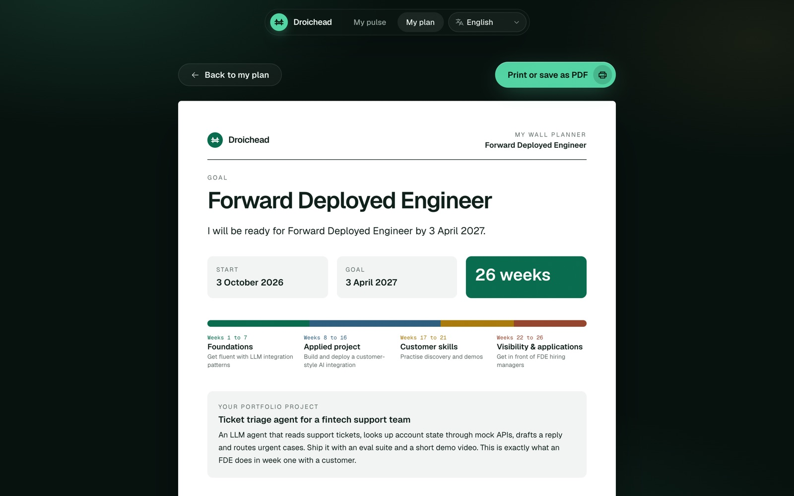 | 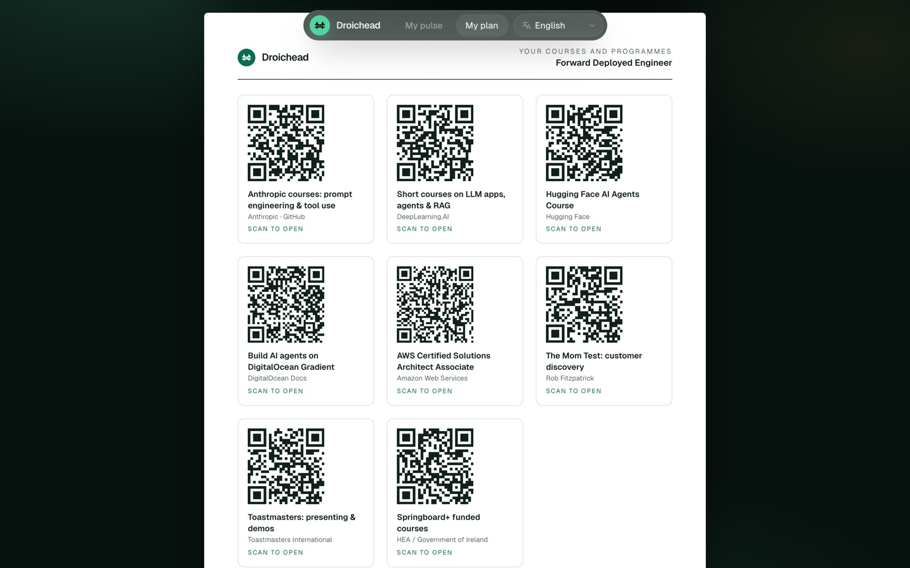 |

### 6. Seven languages
**English, Gaeilge, Polski, Українська, Español, Deutsch and Français.** The interface, the AI answers, read-aloud and dictation all follow the language you choose. Try the two demo personas: **Aoife**, a software developer in Dublin (English), and **Оксана**, an accountant in Cork (Ukrainian).

| Bento | Mobile |
|---|---|
| 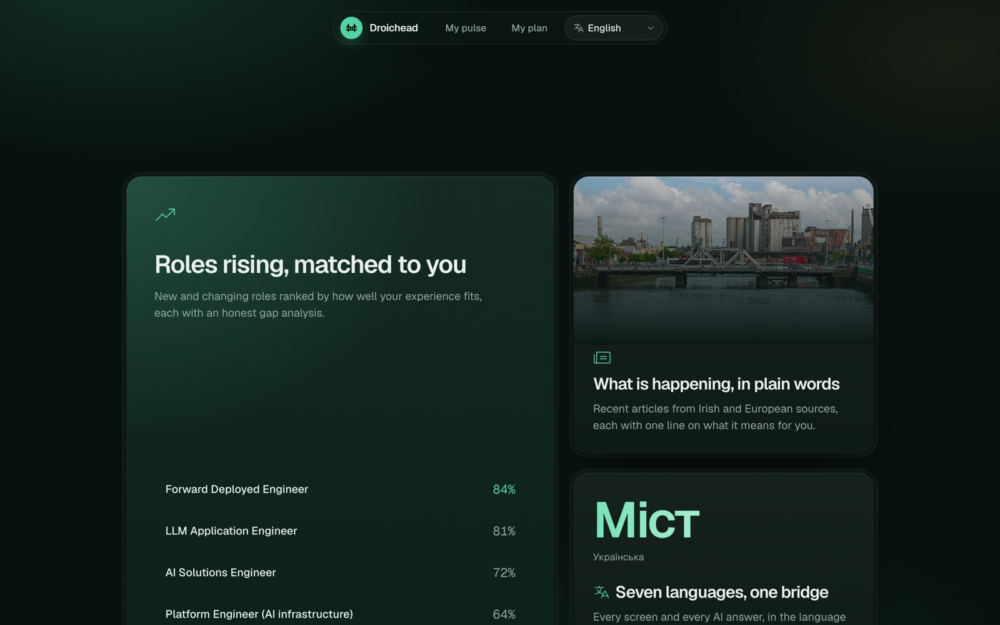 | 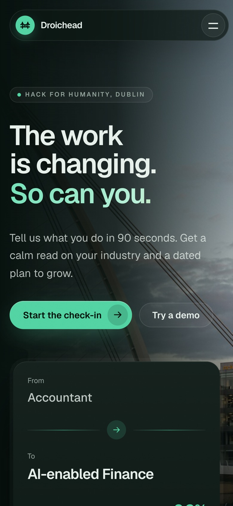 |

---

## Open-source AI

- **Open-weight Gemma 4 everywhere.** Every AI call (roles, news commentary, gap analysis, plan, check-ins, LinkedIn drafts) runs on Google's open-weight **Gemma 4**:
  - **Hosted:** `gemma-4-26b-a4b-it` through Google AI Studio (set `GOOGLE_API_KEY`), with thinking set to minimal. A gap analysis takes about 4 seconds and a 26-week plan about 23.
  - **Fully local:** `gemma4:12b` through [Ollama](https://ollama.com) when no key is set. Your answers never leave your computer.
  - **Any OpenAI-compatible endpoint** that serves open-weight models (DigitalOcean Inference, Groq, vLLM and so on) via `LLM_PROVIDER=openai`, `LLM_BASE_URL`, `LLM_API_KEY` and `LLM_MODEL`.
- **An Agent Skill.** [`skills/bridge-the-gap`](skills/bridge-the-gap/SKILL.md) packages the gap-analysis and planning method in the Agent Skill format, so any agent can run it.
- **MIT licensed.**

## Privacy and safety by design

- **No accounts, no database, no tracking.** Profiles and plans live in the browser's IndexedDB. You can export, import or delete everything in one tap.
- **Every link shown to a user is real.** News comes straight from RSS feeds, statistics from the CSO PxStat API, jobs from Arbeitnow and Remotive, and courses from a curated catalogue (`data/resources.ts`). The model may only pick resources by id and never outputs URLs.
- **Fetched text and CVs are untrusted data.** The system prompt tells the model never to follow instructions found inside them.
- **Model output is checked.** It's validated against a zod schema and retried once. Identical in-flight requests are shared, abandoned generations are cancelled, and the demo personas have offline fallbacks so a live demo never dead-ends.

## Architecture

```
Browser (Next.js 16, React 19, Tailwind v4, Motion)
  IndexedDB (Dexie): profile, plans, check-ins, 24h cache
  pdf.js (CV reading), Web Speech API (listen / speak), qrcode, canvas-confetti
        |  profile sent per request, never stored
        v
Next.js route handlers (stateless)
  /api/pulse   RSS feeds + CSO PxStat -> Gemma: roles, news commentary, role shifts, economy
  /api/gap     Gemma: have / partial / build
  /api/plan    Gemma + curated resource catalogue -> phased, dated plan
  /api/replan  deterministic rescheduling + Gemma check-in message
  /api/jobs    Arbeitnow + Remotive, matched to the target role
  /api/posts   Gemma: LinkedIn drafts
        |
        v
Gemma 4: Google AI Studio (hosted) or Ollama (local)
```

## Run locally

```bash
npm install
# Option A, fully local: install Ollama, then:
ollama pull gemma4:12b
# Option B, hosted Gemma: put a Google AI Studio key in .env.local
echo "GOOGLE_API_KEY=your-key" > .env.local
npm run dev
```

If no model is reachable, the app still runs and falls back to the demo fixtures. Run `npm run check:i18n` to verify that every locale has every key and no dashes.

## Deploy on Render

The repo includes a Render Blueprint (`render.yaml`):

1. In Render, choose **New > Blueprint** and connect this repo.
2. When prompted, paste your Google AI Studio key as `GOOGLE_API_KEY`.

Render builds the app with `npm ci && npm run build` and starts it with `npm start`. The health check is `/api/health`. On the free plan the service sleeps after about 15 minutes idle, so open the URL a minute before a demo.

## Built with AI, disclosed

- **At runtime:** Gemma 4 (open-weight) generates the suggestions, analyses, plans and messages.
- **While building:** we used Claude Code (Anthropic) as an AI coding assistant to help write code, translations and copy. Product decisions, direction and review were ours.

## Credits

- Photography from Wikimedia Commons:
  - Samuel Beckett Bridge, Dublin, by DXR (CC BY-SA 4.0)
  - Brian Boru Bridge, Cork, by Joachim Kohler-HB (CC BY-SA 4.0)
- Data:
  - [CSO Ireland](https://data.cso.ie/table/MUM01) (MUM01, seasonally adjusted monthly unemployment)
  - [Arbeitnow](https://www.arbeitnow.com) and [Remotive](https://remotive.com) job feeds
  - RSS from RTÉ, Silicon Republic, the Irish Times, the Guardian and TechCrunch
- Icons by Phosphor. Type is Geist.

Career guidance, not financial advice.
